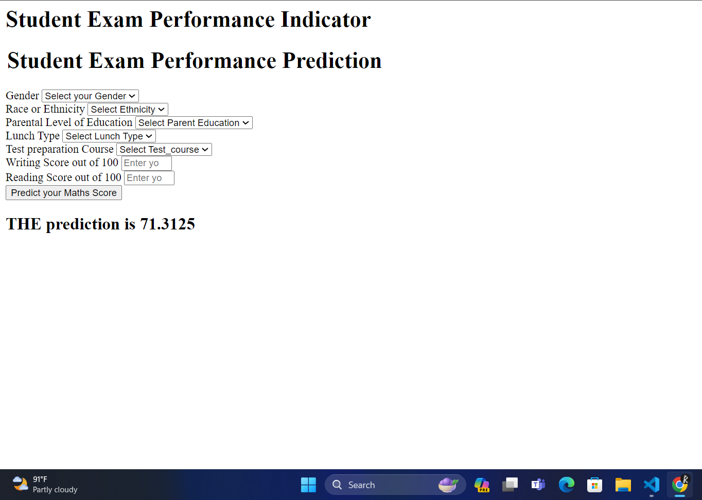

# Student Performance Checker

## Description
The Student Performance Checker is a project aimed at tracking and analyzing student performance using modular coding principles. It utilizes multiple algorithms and is built with Flask, a Python web framework, for the backend. The `app.py` file serves as the entry point for running the application.

## Features
- Modular coding structure for easy maintenance and scalability
- Utilizes multiple algorithms for analyzing student performance
- Web-based interface built with Flask for easy accessibility

## Installation
1. Clone the repository:
2. Navigate to the project directory:
   cd student-performance-checker
   
4. Install dependencies:
   pip install -r requirements.txt

   
## Usage
1. Run the Flask application:
 - python app.py

   2. Open your web browser and go to `http://localhost:5000` to access the application.

## Screenshots

## Contributing
If you'd like to contribute to this project, feel free to fork the repository and submit a pull request. Contributions in the form of bug fixes, feature enhancements, or documentation improvements are welcome.

## License
[MIT License](LICENSE)

## Acknowledgements
- [Flask](https://flask.palletsprojects.com/) - Web framework used for building the application
- [OpenAI](https://openai.com/) - Inspiration and assistance
